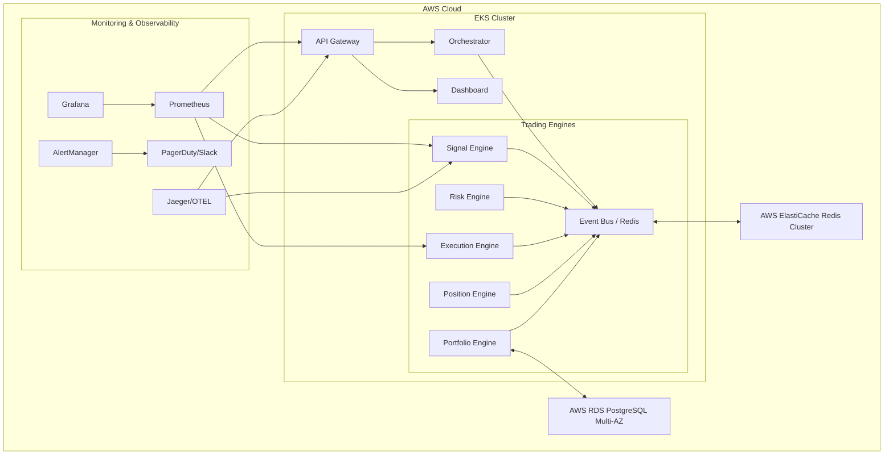

# APEX V3 — Production Operations Guide

This document serves as the single source of truth for the production infrastructure, deployment, and operational recovery of the APEX V3 distributed platform.

## 1. Deployment Architecture

APEX V3 leverages a modern cloud-native stack:
- **Compute**: AWS EKS (Elastic Kubernetes Service) for all microservices.
- **Databases**: AWS RDS Multi-AZ for PostgreSQL HA, ElastiCache for Redis Cluster (Event Bus).
- **Monitoring**: Prometheus, AlertManager, Grafana, Loki (logs), and Jaeger (tracing).
- **Deployment Strategy**: Helm charts managed by ArgoCD (GitOps).

### High-Level Diagram



## 2. Recovery Runbooks

> [!WARNING]
> Always verify the current state using Grafana before initiating manual recovery procedures.

### 2.1 Engine Restart Recovery
The trading engines are stateless regarding their primary execution loops but maintain in-memory state derived from the Event Bus and PostgreSQL.

**Procedure:**
1. If an engine crashes, Kubernetes will automatically restart the pod (`RestartPolicy: Always`).
2. Upon startup, the engine connects to the Event Bus and requests a state synchronization snapshot.
3. The Orchestrator re-publishes the necessary warmup events.
4. **Validation:** Check the engine logs for `State synchronized successfully`. Verify the `engine_sync_status` metric in Grafana is `1`.

### 2.2 Database Failover
PostgreSQL HA is managed by AWS RDS Multi-AZ.

**Procedure:**
1. In the event of a primary node failure, RDS automatically promotes the standby to primary.
2. The endpoint remains the same, but connections will temporarily drop for ~60 seconds.
3. Engines are configured with exponential backoff connection retries.
4. **Validation:** Monitor `database_connection_errors_total`. It should spike and then return to 0.

### 2.3 Event Bus Failover
The Event Bus uses AWS ElastiCache Redis Cluster.

**Procedure:**
1. Redis handles partition tolerance via Cluster Mode. If a master node fails, a replica is promoted.
2. The `event-bus-rs` engine will automatically detect the topology change.
3. **Validation:** Check `redis_cluster_state` in Prometheus.

## 3. Monitoring Procedures & SLOs

### 3.1 Service Level Objectives (SLOs)
- **Execution Latency (Signal to Fill)**: 99th percentile < 10ms.
- **System Availability**: 99.99% uptime.
- **Database Parity Drift**: 0 drift acceptable over a 24-hour period.

### 3.2 Key Grafana Dashboards
- **APEX Core Health**: Overall system status, pod restarts, CPU/Memory usage.
- **Trading Latency**: Detailed histograms of order execution times.
- **Risk & Positions**: Real-time exposure and margin utilization.

## 4. Incident Procedures

> [!CAUTION]
> In the event of an active critical incident (P1), immediately pause all automated trading.

1. **Acknowledge**: On-call engineer acknowledges the AlertManager notification.
2. **Triage**: Use Grafana and Jaeger to pinpoint the failing service or slow span.
3. **Mitigate**:
   - If an engine is stuck: `kubectl delete pod <pod-name> -n apex`
   - If bad logic deployed: Initiate rollback via ArgoCD or Helm.
4. **Resolve**: Restore service to normal parameters.
5. **Post-Mortem**: Document the root cause, timeline, and preventative measures.

## 5. Deployment Procedures

### 5.1 Rolling Deployments (Default)
Handled natively by Kubernetes Deployments.

```bash
# Update image tag in values.yaml, then apply:
helm upgrade apex ./infrastructure/helm/apex -f custom-values.yaml
```
Kubernetes will spin up new pods and terminate old ones progressively ensuring zero downtime.

### 5.2 Blue/Green Deployments
For critical core engines (e.g., Execution Engine), we utilize Service selector switching.

**Procedure:**
1. Deploy the new version (`Green`) with a distinct label (e.g., `version: v2`), but keep the Service pointing to `Blue` (`version: v1`).
2. Run automated integration tests against the `Green` deployment internally.
3. Patch the Service to route traffic to `Green`:
   ```bash
   kubectl patch service apex-execution-engine -p '{"spec":{"selector":{"version":"v2"}}}'
   ```
4. Monitor for 15 minutes. If anomalies occur, revert the patch to `v1`.
5. Once stable, scale down `Blue`.

## 6. Backup & Disaster Recovery
- **Database**: Automated daily snapshots retained for 14 days via AWS RDS. Point-In-Time-Recovery (PITR) enabled.
- **Configuration**: All infrastructure and configuration are stored in Git.
- **Disaster Recovery**: In a full region outage, apply the Terraform configuration to a new region, restore the RDS snapshot, and sync ArgoCD. RTO < 2 hours, RPO < 5 minutes.
